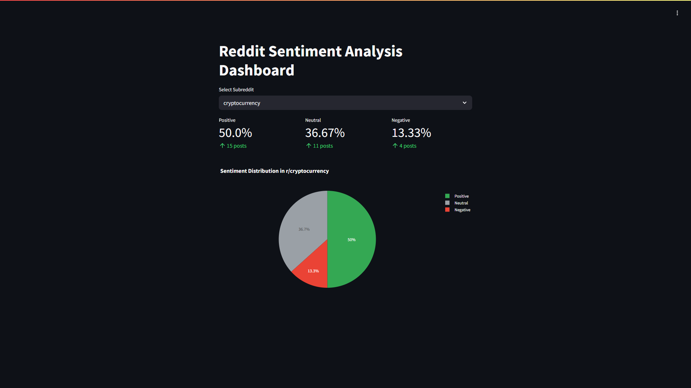
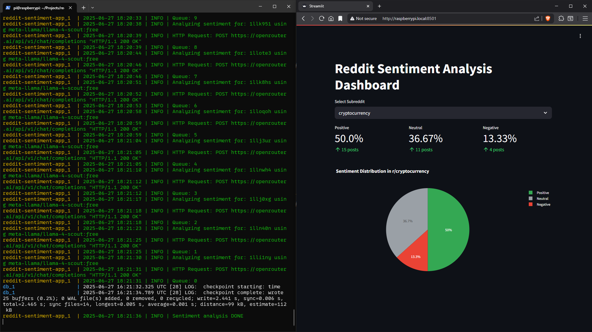

# Reddit Sentiment App

This project enables sentiment analysis of posts from any subreddit on Reddit using large language models (LLMs). It collects data from Reddit, processes the sentiment with advanced NLP models, and stores the results in a PostgreSQL database. The analyzed data is then visualized through an interactive Streamlit dashboard, providing users with clear insights into community sentiment and trends.

## Description

This project is a comprehensive sentiment analysis platform focused on Reddit data. It collects posts from any chosen subreddit and uses large language models (LLMs) to perform detailed sentiment classification, categorizing posts as positive, negative, or neutral. The analyzed results are stored securely in a PostgreSQL database for efficient management and scalability. Users can explore the sentiment data through an interactive Streamlit dashboard that visually presents the percentage breakdown of positive, negative, and neutral posts, complemented by a pie chart illustrating the overall sentiment distribution within the selected subreddit. This clear and dynamic visualization enables users to quickly grasp the community mood and track sentiment trends over time. The project is ideal for researchers, marketers, social scientists, and anyone interested in monitoring and analyzing public opinion on Reddit

### Dashboard


### Running program


## Getting Started

### Prerequisites

Before installing and running the program, ensure your system meets the following prerequisites:
- Operating System: Windows 10 (or newer), Linux (e.g., Debian, Ubuntu), or macOS with Python 3.8+ installed.
- Python version: Python 3.8 or higher.
- Libraries: The project requires the following Python packages, which can be installed via pip using the provided requirements.txt:
  - PyYAML (version ~6.0.2)
  - APScheduler (~3.11.0)
  - python-dotenv (~1.1.0)
  - psycopg2-binary (~2.9.10) — for PostgreSQL database connection
  - openai (~1.90.0)
  - PRAW (~7.8.1) — Reddit API wrapper
  - plotly (~6.1.2) — for data visualization
  - streamlit (~1.45.1) — for the dashboard interface

Make sure PostgreSQL database server is installed and running, with credentials properly configured in your .env file.

### How to Download and Setup

- Clone this repository to your local machine using Git:
    ```
    git clone https://github.com/bartosz-musial/reddit-sentiment-app
    ```
- Alternatively, download the project as a ZIP file from GitHub and unzip it.

### Required Modifications Before Running

- Rename the .env.example file to .env and fill in your configuration details, such as Reddit API credentials, PostgreSQL connection info, and OpenAI API key.
- Ensure PostgreSQL server is installed and running, and create the necessary database according to the config.
- Modify the configuration files (e.g., config.yaml) if you want to change default settings like subreddits to analyze.

### How to Run the Program Using Docker Compose

1. Make sure Docker and Docker Compose are installed on your machine.
2. Clone the repository:
    ```
    git clone https://github.com/bartosz-musial/reddit-sentiment-app
    cd reddit-sentiment-app
    ```
3. Configure environment variables:
   - Copy .env.example to .env
   - Edit the `.env` file and provide your Reddit API credentials, PostgreSQL connection details, and OpenRouter API key.
4. Start the application stack (PostgreSQL + your app + dashboard):
    ```
    docker-compose up --build
    ```
5. Access the Streamlit dashboard by opening the URL displayed in the terminal (usually http://localhost:8501).
6. To stop the containers, press CTRL+C and then run:
    ```
    docker-compose down
    ```

## License

This project is licensed under the MIT License - see the `LICENSE.md` file for details